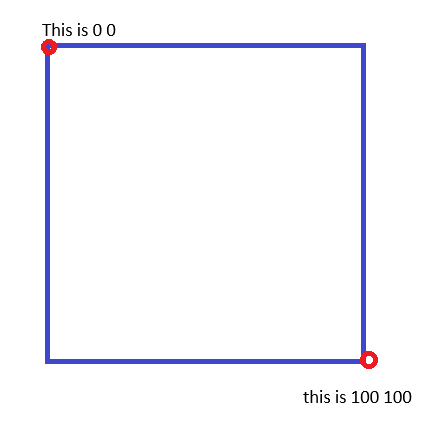
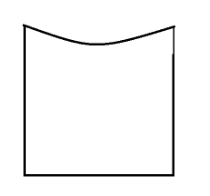

# Learned Basics of how SVGS Work

Hi, if you're reading this that's pretty neat. During this project I learned something I feel is cool, and felt compelled to explain it in simple terms for myself for the fun of it.

In case you don't already know, an SVG are kinda just pictures. A lot of pictures on a site that simple shapes, like logos, are usually SVGS. These are great because they're just math essentially and can be scaled virutally as big or small as you want with no drop in quality and speedier loading times than using other image types. So I will indulge in an example and guide on how to make a curved top box

We got a div with height (500px) and width (500px). A square.

## Guide

viewbox : is a property of the </svg/> tag, think of it as a fraction version of your box. The number you choose depends on how much control you want on where to put control points (vertices).

### Visual for our box

"0 0" = is left of a div.
"100 100" = bottom right

```HTML
<svg viewbox="100 100"><path></svg>
```



### What Acronyms Mean for the Next Example

- "x" = horizontal co-ordinate
- "y" = vertical cor-odinate

---

- "a" = a set of co-ordinates
- "b" = a different set of co-ordinates for a different vertex(or control point of the line ie: angle)
- "c" = a third set of different co-ordinates

## How to Make a rectangle

- M (x) (y) = *M*ove cursor to any co-ordinate on the box
- L (x) (y) = draw a *L*ine ending at any co-ordinate on the box
- Z = finish line or move at the initial co-ordinates set.

With everything you now how to make a rectangle SVG.

```HTML
<svg viewbox="100 100"><path d="M 0 0 L 100 0 l 100 100 l 0 100 Z"></svg>
```

## How to make a curved Top Example



- Q (a) (a) (b) (b) = a quadratic, in digital art we call this the bezier handle. Think of it as a transparent coordinate to pull the line to. This makes a curve, but only on one vertex at a time.
- C (a) (a) (b) (b) (c) (c) = A "Cubic Bezier Curve" (a) (a), is the first control point for the first vertex of the line. (b), (b) is the second control point for the endpoint of the line, and finally, (c) (c), the end point of the line.

```HTML
  <svg
    viewBox="0 0 100 100"
    preserveAspectRatio="none" # i felt this one was a given with the name
    className="w-full h-full absolute"
    >
     <path
     className="fill-vibrant-red"
     d=" M 0 0 C 30 40 60 40 100 0  L 100 100 L 0 100 Z "
     >
     </path>
  </svg>
```

I thought I could make this shorter, teehee, but Maybe in the future I'll find an even simpler way to explain it for myself, and anyone else who finds this.
